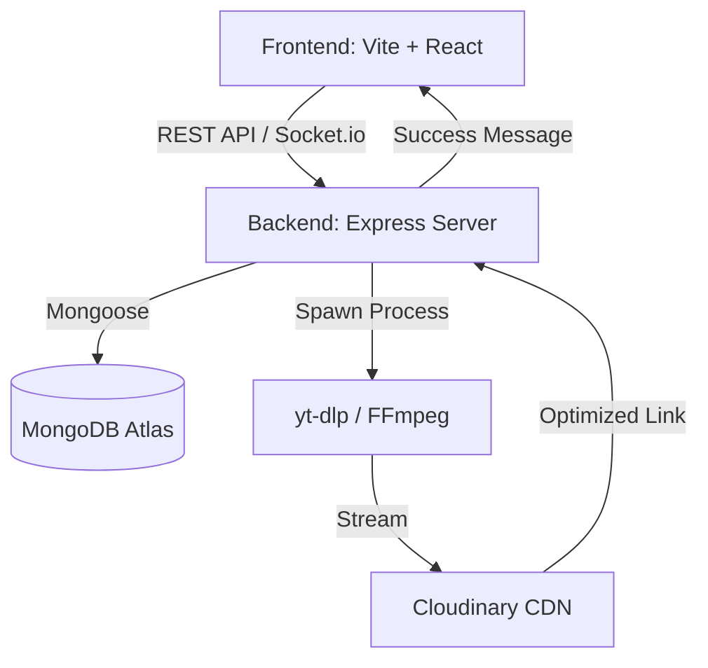

# VideoDownloader X: Modern Multi-Platform Downloader 🚀


## Overview
**VideoDownloader X** is a high-performance, full-stack web application designed to provide a seamless video downloading experience. Built with the **MERN** stack (MongoDB, Express, React, Node.js), it integrates powerful back-end processing via `yt-dlp` and `FFmpeg` to support high-quality downloads from platforms like YouTube, TikTok, Facebook, and more.

The application focuses on a **premium UI/UX** experience, featuring glassmorphism, fluid animations, and a real-time progress tracking system.

---

## ✨ Key Features

- **🚀 Multi-Platform Support**: Download videos from YouTube, TikTok, Facebook, Instagram, and Twitch.
- **💎 Premium Design**: Modern, responsive UI with glassmorphic elements and dark/light mode support.
- **🔄 Real-Time Progress**: Instant feedback on download status and conversion via Socket.io.
- **🛡️ Secure Authentication**: JWT-based user authentication and protected API routes.
- **📚 Download History**: Personal library to track and manage your downloaded content.
- **☁️ Cloud-Native Streaming**: Seamless integration with Cloudinary for fast and storage-efficient processing.
- **📡 Bot Detection Bypass**: Hardened request headers and cookie support to bypass platform restrictions.

---

## 🛠️ Technical Stack

### Frontend
- **Framework**: [React](https://reactjs.org/) with [Vite](https://vitejs.dev/)
- **Styling**: [TailwindCSS](https://tailwindcss.com/)
- **Animations**: [Framer Motion](https://www.framer.com/motion/)
- **State Management**: React Hooks & Context API
- **Real-time**: [Socket.io Client](https://socket.io/)

### Backend
- **Server**: [Node.js](https://nodejs.org/) & [Express](https://expressjs.com/)
- **Database**: [MongoDB Atlas](https://www.mongodb.com/atlas)
- **Processing Engine**: [yt-dlp](https://github.com/yt-dlp/yt-dlp) & [FFmpeg](https://ffmpeg.org/)
- **File Storage**: [Cloudinary](https://cloudinary.com/) (Stream-upload protocol)
- **Authentication**: JsonWebToken (JWT) & BcryptJS

---

## 🏗️ Project Architecture



---

## 🚀 Getting Started

### Prerequisites
- Node.js (v18+)
- MongoDB Atlas Account
- Cloudinary Account
- Python (for yt-dlp)

### Installation

1. **Clone the repository**:
   ```bash
   git clone https://github.com/KOTOEWai/Downloader.git
   cd Downloader
   ```

2. **Install Dependencies**:
   ```bash
   npm run install:all
   ```

3. **Environment Setup**:
   Create a `.env` file in the `backend/` directory with the following:
   ```env
   MONGO_URI=your_mongodb_uri
   JWT_SECRET=your_jwt_secret
   CLOUDINARY_CLOUD_NAME=your_name
   CLOUDINARY_API_KEY=your_key
   CLOUDINARY_API_SECRET=your_secret
   ALLOWED_ORIGINS=http://localhost:5173
   YT_USER_AGENT=your_browser_user_agent
   ```

4. **Run Locally**:
   ```bash
   npm run dev
   ```

---

## 🌍 Deployment

### Frontend (Vercel)
- **Root Directory**: `frontend`
- **Build Command**: `npm run build`
- **Output Directory**: `dist`
- **SPA Rewrite**: Handled via `vercel.json`

### Backend (Render/Koyeb)
- **Runtime**: Docker (recommended) or Node.js
- **Scaling**: 1 Dedicated CPU recommended for FFmpeg processing.
- **Cookies**: Upload `cookies.txt` to the `backend/` directory to bypass bot detection.

---

## 📝 License
This project is licensed under the MIT License - see the LICENSE file for details.

---
*Created with ❤️ by Antigravity*
